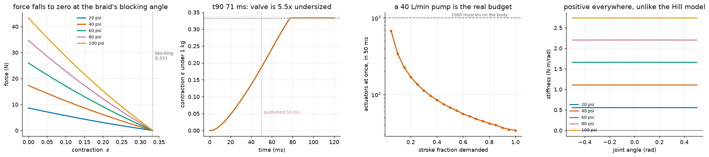

# S11: A Myofiber-Class Hydraulic Actuator

S9 characterised MS-Human-700 and found that MuJoCo's Hill muscle cannot stand
in for Clone's Myofiber on the two properties a controller actually touches:

* `tendon_stiffness` is zero for all 700 tendons, so there is no series
  elasticity, and co-contraction stiffness **changes sign** over roughly 40% of
  every joint's range.
* Activation is a first-order filter with fixed time constants and a
  deactivation penalty of exactly 4x baked in.

Neither is a defect in MuJoCo. A Hill muscle is a good model of a muscle and
the wrong model of a braided hydraulic actuator. This builds the right one.



---

## Sizing: two published numbers pin two geometry parameters

This is an inference, not a fit. Clone publishes that a Myofiber gives **over
30% unloaded contraction** and that a **3 g fibre produces at least 1 kg**.

For a braided (McKibben-class) actuator, force reaches zero at the braid's
blocking angle, giving a closed form for maximum contraction:

    eps_max = 1 - 1 / (sqrt(3) cos(theta0))

Requiring `eps_max > 0.30` alone constrains the rest braid angle to
**theta0 < 34.4 degrees**, with no other input. Taking `theta0 = 30 deg` as the
design point and a 2 mm x 100 mm fibre:

| | value | published | check |
|---|---|---|---|
| max contraction | 33.3% | > 30% | passes |
| blocking angle | 54.736 deg | 54.7356 (classic result) | matches to 1e-3 |
| force at 100 psi | 43.3 N | at least 9.81 N | passes |
| water mass | 1.25 g | 3 g fibre | passes (plus sleeve and fittings) |
| force per gram | 34.6 N/g | | |

Every comparison is an inequality **in the direction the specification states**.
A spec that says "at least 1 kg" is not satisfied by fitting to exactly 1 kg,
and treating it as an equality would be fitting the model to the number instead
of testing it against it.

---

## Result 1: the pump is the real budget

A full stroke moves a fixed fluid volume, so demanding it in a fixed time sets
a flow rate, and the published pump rating divides into a count.

| | |
|---|---|
| Stroke volume, one fibre | 0.977 mL |
| Flow to complete it in 50 ms | 1.17 L/min |
| Published pump | 40 L/min |
| **Actuators at full stroke, full speed, simultaneously** | **34** |
| As a fraction of Protoclone's ~1000 muscles | **3.4%** |
| Whole-body stroke volume | 0.98 L |
| Time to fill every actuator once, at full pump | 1.47 s |

**This constraint has no analogue on a torque-actuated humanoid.** A motor
draws current from a bus that can usually supply it. Here the working fluid
itself is rationed, and the ration is tight: at full stroke and full speed the
published pump serves about 3% of the body at a time. Real motion is
partial-stroke, and the curve in panel 3 shows how the count rises as the
demanded stroke fraction falls, but any controller for a machine like this is
solving a scheduling problem the whole robotics literature on humanoids does
not have.

## Result 2: the published response time implies a valve 5.5x bigger than the naive estimate

Sizing the orifice the obvious way (stroke volume / response time, at a mean
driving head of half supply) gives 1.2e-6 m², a 1.24 mm orifice. Simulated
against the published 1 kg rated load, that actuator reaches 90% contraction in
**70.7 ms**, missing the published 50 ms.

The naive estimate is optimistic because it ignores the pressure build-up
transient and the load's inertia. Bisecting on orifice area for the one that
actually meets the spec:

| | |
|---|---|
| Naive sizing | 1.20e-6 m², 1.24 mm |
| **Required** | **6.60e-6 m², 2.90 mm** |
| Undersize factor | **5.5x** |

That is a component requirement derived from a published behaviour, which is
the useful direction to run the inference.

## Result 3: fill/vent asymmetry is plumbing, not physics

A Hill muscle deactivates 4x slower than it activates, by construction, and no
amount of engineering changes it. A valve-driven actuator is different:

| plumbing | fill (to 63%) | vent (to 37%) | asymmetry |
|---|---|---|---|
| symmetric, zero return pressure | 0.354 ms | 0.354 ms | **1.000** |
| 15 psi return back-pressure | 0.354 ms | 0.410 ms | 0.864 |

With symmetric orifices and an unrestricted return, fill and vent are *exactly*
symmetric: both see the same head at their respective extremes. The asymmetry
that a Hill muscle has for free has to be plumbed in here, and can be plumbed
out. For anyone porting a controller between the two models that is the
difference between compensating a fixed 4x penalty and compensating whatever
the return line happens to do.

One measurement note. Orifice flow scales with `sqrt(supply - P)`, so the
driving head vanishes as the actuator approaches supply and the last few
percent take arbitrarily long. A 10-90% time against supply pressure is
therefore the wrong statistic; the first version of this function returned NaN
for it, correctly, and it now reports time to 63% of supply, the natural time
constant of the fill.

## Result 4: series elasticity fixes what S9-C found broken

The same measurement S9-C ran on MS-Human-700, on an antagonist pair of these
actuators: two identical fibres on opposite sides of a 3 cm moment arm, both
at the same pressure, stiffness by central difference of the net torque.

| | MS-Human-700 (S9-C) | Myofiber pair (S11) |
|---|---|---|
| Sign changes over the range | 1 to 2 at every joint | **0** |
| Fraction of range with negative stiffness | ~40% at every joint | **0%** |
| Scales with command | linear in co-contraction | linear in pressure, to 2% |
| Magnitude | -276 to +481 N·m/rad | 0.56 to 2.74 N·m/rad |

**No sign changes anywhere, at any pressure.** The stiffness is small, and that
is not a defect either: a braided sleeve is a soft spring, which is why
McKibben-class actuators feel compliant and why series elasticity dominates the
result. The Hill model's much larger numbers come from the moment-arm
derivative term, which is exactly the term whose sign flips.

`K` at the neutral angle is proportional to pressure to within **2%**
(0.559, 1.112, 1.660, 2.202, 2.739 N·m/rad at 20 through 100 psi).

---

## Two bugs found on the way

### 1. The bisection bracket forbade extension

`solve_length` splits a total length between the contractile element and its
series spring by bisection. The first bracket ran from full contraction to the
rest length, on the reasoning that a braid contracts.

A braid also *extends*. Pulled longer than its rest length its braid angle
falls and it pulls harder, and that is precisely the state an antagonist pair
puts one of its members into. Capping the bracket at `L0` pinned the stretched
actuator at the bound and returned a tension that was not an equilibrium. The
joint stiffness curve came out flat at 72 N·m/rad across almost the whole
range, a number that looked plausible and was the series spring constant times
the squared moment arm, i.e. the answer you get when the solver has stopped
solving.

### 2. A pinned solve returns a number, not an error

Widening the bracket fixed most of it, but at 20 psi and half a radian the
braid is too weak to hold the stretch and the solve still landed on the bound,
with a residual of -11 N against a nominal 1e-8. That single point set the
reported maximum stiffness for its whole pressure level and made
`K_scales_with_pressure` come out false.

`solve_length` now returns a `converged` flag, the stiffness sweep excludes
non-converged points from its statistics and counts them, and the run log
records the count. It is currently zero at every pressure.

Related: `K_scales_with_pressure` originally compared the *maximum* stiffness
across pressures, which compares different joint angles to each other. It now
compares the neutral angle, where the two actuators are in the same state.

---

## Reproduce

```bash
python -m s11_myofiber.characterize
```

About 70 s on one CPU core, most of it the valve-area bisection (24 loaded
contraction simulations at 2 µs steps). Writes `media/s11/myofiber.png`, a
JSONL run log under `runs/`, and a `result.json` with every number above.

No dependency on MuJoCo or on the Menagerie assets: this is a standalone
actuator model.

---

## Scope and honesty

This is **not** Clone's design, which is not public. It is the closest
publicly documented actuator class (McKibben braided contractile, the standard
virtual-work force model from Chou and Hannaford 1996), sized so that its
published behaviour matches Clone's published behaviour. Where a number here
agrees with theirs, that is because it was constructed to; where it goes
further (the flow budget, the valve requirement), it is a prediction of the
model class and should be read as such.

The published figures used, all from Clone's public material and press
coverage: over 30% unloaded contraction, under 50 ms response, 3 g fibre at
1 kg force, a 500 W pump delivering 40 L/min at 100 psi, and roughly 1000
muscles on Protoclone V1.

## Known limitations

* **Quasi-static braid.** The force model is the ideal virtual-work result. It
  omits bladder wall thickness, braid friction, and the end-cap effects that
  make real McKibben actuators hysteretic. S4 measured exactly that class of
  hysteresis on a tendon finger; the same protocol applied here is the obvious
  next measurement and is not done.
* **One actuator, one joint.** The stiffness result is an antagonist pair on a
  revolute joint, not a limb. Nothing here has been put into MS-Human-700 in
  place of its Hill muscles, which is the natural continuation.
* **The pump is a constant.** The flow budget treats 40 L/min as available
  regardless of pressure. A real pump has a head-flow curve, and near supply
  pressure it will deliver less.
* **No thermal or efficiency model.** The published 500 W is not used for
  anything except context.
