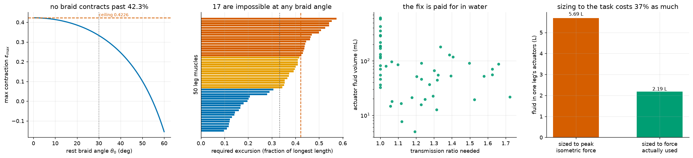

# S12: Can a Braid Replace a Human Muscle?

S11 built a Myofiber-class actuator and checked it against Clone's published
figures. The obvious next step is to put it in a body: take the 50 muscles
spanning MS-Human-700's right leg and replace each with a braid.

It does not work one-for-one, and the reason is geometric rather than
engineering.



---

## Result 1: no braid contracts more than 42.3%

A braided sleeve's maximum contraction has a closed form,

    eps_max(theta0) = 1 - 1 / (sqrt(3) cos(theta0))

which rises as the rest braid angle falls and has a supremum as `theta0 -> 0`:

    1 - 1/sqrt(3) = 0.42265...

Verified against a 4000-point sweep: monotone decreasing in `theta0`, never
exceeding the closed form. **This is a ceiling on the actuator class, not on a
particular design.**

Against it, the leg's muscles need a median excursion of **37.3%** of their
longest length:

| | |
|---|---|
| Excursion range across 50 muscles | 9.8% to 57.4% |
| Exceed a 30 deg braid (33.3%) | **31 of 50** |
| Exceed a 20 deg braid (38.6%) | 24 of 50 |
| **Exceed the 42.3% ceiling, so impossible at any braid angle** | **17 of 50** |

The seventeen are not a random seventeen. They are the glutei (`glmax1-3`,
`glmed1/3`, `glmin1/2`), the adductors (`addbrev`, `addmag` x3), `sart`,
`grac`, and the psoas group: the large hip muscles, the ones with long fibres
and long throws. Anatomy picked exactly the muscles a braid is worst at.

## Result 2: the fix is a transmission, and it is paid for in water

A stroke-amplifying transmission of ratio `n` lets the actuator travel `1/n` of
the tendon's excursion for `n` times the force. Choosing
`n = required / eps_max` makes the actuator exactly as long as the muscle it
replaces, which is the natural rule when it has to fit in the same limb.

Median ratio **1.12**, maximum **1.72**. Because force scales with `n` and
radius with `sqrt(n)`, **fluid volume scales linearly with the ratio**. The
transmission is not free; it is paid for in water, and therefore in pump flow.

## Result 3: sizing to peak isometric force is the wrong target, by 2.7x

The obvious sizing target is what each muscle *can* produce. S9 measured what
they actually produce: a median 95th-percentile activation of **0.42** across
277 stance problems, because a human muscle is enormously over-provisioned
relative to standing on it.

Sizing to both:

| | peak isometric | force actually used |
|---|---|---|
| Summed force, one leg | 50,137 N | 18,684 N (**37.3%**) |
| Fluid in the actuators | 5.69 L | **2.19 L** |
| Water mass | 5.67 kg | **2.18 kg** |
| Pump demand, 1 Hz full-stroke cycling | 531 L/min | **204 L/min** |

Neither fits the published 40 L/min pump at full-stroke cycling, which is a
deliberate worst case: real gait uses partial strokes, and S11's curve shows
how the count rises as the demanded stroke fraction falls. The ratio is the
transferable part. **A machine built to match a human's peak capability is
2.7x the machine needed to do a human's actual work**, in fluid, in mass, and
in pump.

## Result 4: the arithmetic on fibre count

At Clone's published 9.81 N per fibre:

| | |
|---|---|
| Fibres to match one leg at peak isometric force | **5,111** |
| Fibres to match one leg at the force actually used | **1,905** |
| Published muscle count for the whole of Protoclone V1 | ~1,000 |

Read carefully, because this is not a criticism. It means the published 3 g
fibre cannot be a one-for-one stand-in for a human muscle at human force
levels, and something else must be true: the fibres are bundled, or the
published figure is a unit cell rather than a muscle, or the machine is
deliberately weaker than a human, or some combination. All three are reasonable
engineering choices. What the number rules out is the naive reading, that
1000 published fibres reproduce a human's musculature.

The same arithmetic in the other direction is the useful one. Sizing one braid
per muscle at 100 psi to match `vaslat_r`'s 5,149 N takes a **44 mm diameter**
sleeve. Real designs bundle many small fibres instead, which is presumably why
Protoclone has a thousand of them.

---

## Checks

| check | result |
|---|---|
| Closed-form ceiling vs 4000-point numeric sweep | never exceeded |
| `eps_max` monotone decreasing in `theta0` | holds |
| Sizing round-trip: does each sized actuator make the force asked of it | max relative error **4.1e-16** |
| Volume, mass and radius consistency | derived from one geometry, not fitted |

The sizing round-trip matters more than it looks. Sizing inverts a closed form
to get `r0` from a target force; if the inversion and the forward model
disagreed, every downstream number would be wrong and nothing else in the study
would reveal it.

## Reproduce

```bash
python -m s12_myofiber_leg.analyse
```

About 25 s. Writes `media/s12/myofiber_leg.png`, a run log under `runs/`, and a
`result.json` including the full per-actuator sizing table.

## Scope

The excursion and force data are MS-Human-700's, which is a model of a human,
not of Protoclone. A real machine would not replace human muscles one-for-one;
it would choose its own actuator layout, and the hip muscles that fail here are
exactly the ones a designer would route differently. What this measures is what
the *human* arrangement demands of a braided actuator, which is the relevant
question if a musculoskeletal model is being used as a design reference.

## Known limitations

* **Static excursion.** Required excursion comes from MuJoCo's
  `actuator_lengthrange`, the full range the tendon can reach. A gait cycle
  visits a subset of it, so a task-specific excursion would be smaller and some
  of the seventeen might come back into range. That measurement is not done.
* **The transmission is a number, not a mechanism.** A 1.72:1 stroke amplifier
  has mass, friction and its own hysteresis, none of which is modelled. S4
  measured what that friction does to a tendon drive and the answer was large.
* **One pressure.** Everything is at 100 psi. Higher supply pressure shrinks
  every actuator, and the published figure is a system pressure rather than a
  limit.
