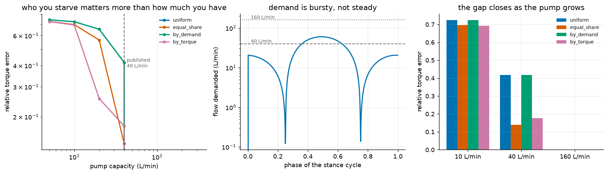

# S13: Control When the Working Fluid Is Rationed

S11 found that Clone's published 40 L/min pump serves about 34 actuators at
full stroke and full speed. S12 found that one leg, sized to the force it
actually uses, wants 204 L/min to cycle at 1 Hz. Both point at the same thing:
**on a hydraulic body, flow is scarce and has to be allocated.**

This constraint has no analogue on a torque-actuated humanoid. A motor draws
current from a bus that can usually supply it, and a controller that asks all
50 joints for their torque at once gets it. Here the working fluid is rationed,
so a controller that asks for everything gets a scaled-down version of
everything, unless it says which requests matter.



---

## The demand is bursty

Tracking S9's stance cycle at 1 Hz with the S12-sized actuators:

| | |
|---|---|
| Mean flow demanded | 25.5 L/min |
| **Peak** | **60.0 L/min** |
| Burstiness (peak over mean) | 2.35 |
| Published pump | 40 L/min |
| **Fraction of the cycle that is flow-limited** | **26.6%** |

The published pump sits between the mean and the peak. On average it is
comfortable; for a quarter of every cycle it is not. Sizing a pump to mean
demand is how you get a machine that works until it has to move quickly.

## The allocation policy is worth 3x

Four policies at the published 40 L/min, scored on relative joint torque error
over the cycle:

| policy | relative error | peak error |
|---|---|---|
| **equal_share** | **0.139** | 0.677 |
| by_torque | 0.176 | 0.830 |
| uniform | 0.417 | 0.910 |
| by_demand | 0.417 | 0.910 |

**Choosing well is worth 3.0x on the same hardware.** That is a larger gain
than most of what a controller can buy elsewhere, and it costs nothing but
knowing that the constraint exists.

## Two results I did not expect

**The informed policy loses.** `by_torque` weights each actuator by how much
its force moves the joints being tracked, which is the obvious thing to
prioritise on. It comes second, behind a policy that knows nothing about the
task at all.

The mechanism is measured, not guessed. At the most flow-limited instant
(60 L/min demanded, 40 available, 27 actuators requesting):

| policy | fully served | median served fraction | worst |
|---|---|---|---|
| uniform | **0 of 27** | 0.667 | 0.667 |
| by_demand | **0 of 27** | 0.667 | 0.667 |
| by_torque | 12 of 27 | 0.925 | 0.371 |
| **equal_share** | **23 of 27** | **1.000** | 0.209 |

`equal_share` fully satisfies most of the requests and concentrates the entire
shortfall on four large ones. Because torque error is a norm over five DoF,
many small correct contributions beat everything being slightly wrong. Spreading
the pain is the worst thing you can do; the naive fair policy happens not to.

**"Prioritise by demand" is a no-op.** `by_demand` and `uniform` produce
*identical* allocations, to the digit, at every timestep. Serving actuators in
proportion to what they asked for is uniform scaling, restated. It sounds like
a policy and is not one, and a system that shipped it would look like it had an
allocator.

---

## Checks

| check | result |
|---|---|
| Unlimited pump collapses every policy to the unconstrained case | error **0.0** for all four |
| Capacity never exceeded, at any timestep, under any policy | holds |
| Error monotone decreasing in capacity, per policy | holds for all four |
| Error reaches zero by 80 L/min | holds, consistent with a 60 L/min peak |

The first is the one that matters: it says the differences between policies are
produced by the constraint and not by the plumbing of the experiment.

## The bug that made this study look finished

The first version tracked only the bladder's compliance volume, `C P`. That is
microlitres. It missed the braid's *geometry*: as a sleeve shortens it balloons
radially, and `V(eps)` swings by nearly a millilitre per actuator over a full
stroke, four orders of magnitude more.

With only the compliance term, mean demand came out at **0.003 L/min**, no
policy was ever constrained, and all four tied at exactly zero error. It read
like a clean negative result: a 40 L/min pump is never the binding constraint.
Every check passed, because a constraint that never binds is trivially
respected.

Four policies tying at exactly zero is the tell. Identical results across
genuinely different algorithms mean the thing that distinguishes them has
stopped existing.

## Reproduce

```bash
python -m s13_flow_control.schedule
```

About 40 s. Writes `media/s13/flow_control.png`, a JSONL run log, and a
`result.json` with the full policy-by-capacity table.

## Known limitations

* **Allocation is greedy and instantaneous.** Each timestep is solved on its
  own with no lookahead. A scheduler that knew the cycle ahead could pre-charge
  actuators during the 73% of the cycle with spare capacity, and that is the
  obvious next study. The burstiness figure of 2.35 is exactly the headroom it
  would have to work with.
* **The pump is a constant.** Real pumps have a head-flow curve and deliver
  less near supply pressure.
* **One leg, one cycle, one cadence.** Peak demand scales with cadence, so the
  flow-limited fraction is a function of how fast the machine is asked to move,
  and only 1 Hz is measured here.
* **No accumulator.** A pressure accumulator is the standard fix for bursty
  hydraulic demand and would change the answer substantially. It is not
  modelled, which makes the 26.6% figure a worst case for a system without one.
