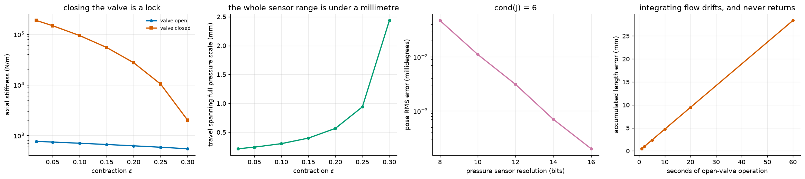

# S14: What Pressure Tells You About Where the Limb Is

A musculoskeletal robot is hard to instrument. There is no clean place to put a
joint encoder on a tendon-routed skeleton, and Clone's public material talks
about pressure rather than position. So: what does a pressure vector actually
tell you?

Close a valve and the fluid is trapped, so `V_braid(eps) + C P = constant`. Any
change in contraction has to be absorbed by pressure, which makes P a readout
of contraction and therefore of joint angle. A closed Myofiber is, in
principle, its own encoder.

In practice the same equation says something more useful and much less
convenient.



---

## Result 1: a closed valve is a lock, not a sensor

Water is near-incompressible, so trapping it makes the actuator dramatically
stiffer than the same actuator at constant pressure:

| contraction | valve open | valve closed | ratio |
|---|---|---|---|
| 0.02 | 764 N/m | 187,857 N/m | **246x** |
| 0.05 | 741 N/m | 148,199 N/m | 200x |
| 0.10 | 702 N/m | 94,618 N/m | 135x |
| 0.30 | 546 N/m | 2,004 N/m | 3.7x |

Below about 10% contraction the closed actuator is stiffer than its own series
element, so the tendon becomes the limiting compliance rather than the fluid.

This is a genuinely useful property that has no equivalent on a motor-driven
robot: **a joint can be held with zero flow and zero power** by shutting a
valve. It is also the reason for the next result.

## Result 2: an exquisite sensor over a uselessly small range

The same stiffness that makes the lock work makes the sensor saturate. The
entire 0 to 100 psi span corresponds to:

| contraction | travel spanning full scale | as % of stroke | resolution at 12 bits |
|---|---|---|---|
| 0.02 | 0.215 mm | 0.65% | 0.053 µm |
| 0.05 | 0.242 mm | 0.73% | 0.059 µm |
| 0.30 | 2.436 mm | **7.31%** | 0.595 µm |

**Sub-micron resolution, and under 8% of the stroke before saturation.** The
two numbers trade against each other through the same derivative and there is
no design that gets both without changing the bladder compliance.

The practical reading: a closed Myofiber is a superb *force* and *contact*
sensor, and a poor position sensor. If a limb has moved a degree, the pressure
reading pinned long ago.

## Result 3: pose is observable, and conditioning is the useful number

With valves closed, `dP_j/dq_i = (dV_j/deps_j) / (C_j L0_j) * R_ji`. That is the
moment-arm matrix with each row scaled by a positive constant, and row scaling
cannot change rank. So pose observability from pressure reduces exactly to the
rank question S9 already answered for actuation.

| | |
|---|---|
| Pressures | 50 |
| DoF | 5 |
| Rank of the pressure Jacobian | **5, full** |
| Rank preserved under row scaling | confirmed |
| Condition number, moment arms | 3.82 |
| Condition number, pressure Jacobian | **6.35** |

Pose is fully observable. The row scaling costs a factor of 1.7 in
conditioning, because actuators differ in how hard they push back.

Least-squares pose from noisy pressures, for a 0.1 mrad perturbation:

| sensor | noise | pose RMS error |
|---|---|---|
| 8 bit | 2693 Pa | 0.047 millidegrees |
| 12 bit | 168 Pa | 0.003 millidegrees |
| 16 bit | 10.5 Pa | 0.0002 millidegrees |

The estimator is exact without noise (1.3e-19 rad), which is the check that the
inversion is right rather than the noise being small. **Within its range,
pressure sensing is absurdly precise.** The problem was never resolution.

## Result 4: the open-valve alternative drifts, and never comes back

Open valves destroy the trapped-volume relation, so the only route to position
is integrating what went in. Integration has no restoring term, so a
proportional flow-sensor bias walks off linearly. At 1% flow error and 1 Hz
cycling:

| elapsed | length error | as % of stroke |
|---|---|---|
| 1 s | 0.47 mm | 1.4% |
| 10 s | 4.73 mm | 14.2% |
| 60 s | 28.37 mm | **85.1%** |

A minute of open-valve operation at 1% flow error loses most of the stroke.

## The design that falls out

Neither mode works alone, and they fail in complementary ways. Closed valves
give sub-micron absolute position over a fraction of a millimetre; open valves
give unlimited range with unbounded drift. The obvious architecture is to
integrate flow while moving and re-zero against pressure whenever a valve
closes, which is to say **treat valve closures as position fixes**. A limb that
holds still occasionally is a limb that stays calibrated, and one that never
stops moving does not.

That is a design suggestion, not a measurement. Nothing here implements or
tests it.

## Reproduce

```bash
python -m s14_proprioception.pressure
```

About 15 s. Writes `media/s14/proprioception.png`, a run log, and a
`result.json`.

## Known limitations

* **Local linearisation.** The observability and estimator results are for
  small perturbations about one operating point. Over a real trajectory the
  Jacobian changes and the conditioning with it.
* **The estimator is a bound, not a proposal.** Least squares on the exact
  Jacobian is the best any estimator can do with this measurement at this
  point; a real filter has to track the Jacobian and will do worse.
* **Perfect valves.** Closed means closed. Real valves leak, and a leak turns
  the lock into a slow drift and the position fix into a decaying one.
* **No temperature.** Fluid bulk modulus and bladder compliance both move with
  temperature, and both sit directly in the sensitivity.
