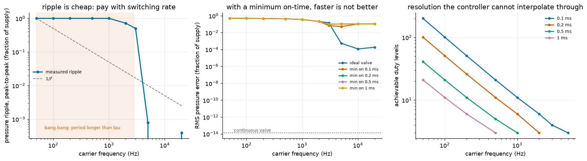

# S15: What a Real Valve Costs

S9-D showed a muscle's activation lag is an invertible filter worth about 500x
in tracking error once compensated. S13's allocation policies assume a valve
that can be held at any opening. Both assume a *proportional* valve. Clone's
published Aquajet runs under a watt, which is the power budget of a solenoid
that is either open or shut, and a solenoid tracks a continuous command by
switching.



---

## Result 1: PWM does not average, at any realistic valve speed

The actuator's isometric fill time constant is **0.354 ms** (S11), a bandwidth
of 450 Hz. PWM averages only when the carrier period is *short* against that
time constant. Sweeping an ideal (zero minimum on-time) valve:

| carrier | period / tau | ripple, peak-to-peak | RMS error |
|---|---|---|---|
| 50 Hz | 56.5 | **1.000** (full scale) | 0.490 |
| 100 Hz | 28.2 | **1.000** | 0.490 |
| 500 Hz | 5.65 | **1.000** | 0.435 |
| 1 kHz | 2.83 | **1.000** | 0.359 |
| 2 kHz | 1.41 | 0.718 | 0.215 |
| 3 kHz | 0.94 | 0.502 | 0.147 |
| 5 kHz | 0.57 | 0.00078 | 0.00055 |
| 10 kHz | 0.28 | ~0 | **0.00012** |

**Below about 3 kHz the pressure swings full scale every cycle.** Each PWM
period fully charges and fully discharges the actuator, so switching is
bang-bang, not averaging. A solenoid running at 100 Hz has a period 28 times
the actuator's time constant and produces a square wave between empty and
supply, not a held mid-pressure.

The transition is a **cliff, not a rolloff**: ripple collapses by a factor of
**2,565** between 3 kHz and 5 kHz. The textbook 1/f ripple law describes only
the far side of it, and fitting one across the whole sweep returns a slope of
-3 to -12 depending on where you start, which is a real measurement of the
wrong thing.

## Result 2: a minimum on-time removes the fix

Getting above 3 kHz is the whole game, and a solenoid's minimum on-time is what
stops you. A valve that must stay open at least `t_min` can only realise duty
cycles spaced `t_min * f` apart, so **raising the carrier to fix ripple
directly worsens duty resolution.** The two constraints pull in opposite
directions and the optimum is at neither end:

| minimum on-time | best carrier | best RMS error | vs ideal valve |
|---|---|---|---|
| 0 (ideal) | 10 kHz | 0.00012 | 1x |
| 0.1 ms | 5 kHz | 0.052 | **440x worse** |
| 0.2 ms | 3 kHz | 0.100 | 845x worse |
| 0.5 ms | 3 kHz | 0.100 | 845x worse |
| 1.0 ms | 3 kHz | 0.100 | 845x worse |

A 0.1 ms minimum on-time, which is fast for a solenoid, costs **440x** against
an ideal valve. Past 0.2 ms the optimum stops moving, because the valve can no
longer reach the averaging regime at all and is stuck at the cliff edge.

## The design tension this exposes

There are two ways out, and one of them fights S14.

**Use a proportional valve.** Then the continuous models in S9-D and S13 apply
as written. This costs power, which is the thing the published sub-watt figure
is presumably protecting.

**Add hydraulic compliance.** An accumulator slows the actuator down, moving
the time constant up so a slower carrier lands on the averaging side. This is
the cheap fix and it directly undoes S14's result: it was the *absence* of
compliance that made a closed valve a 246x lock and a sub-micron position
sensor. Compliance enough to make PWM work is compliance enough to soften the
lock.

Those two results were measured independently and they constrain each other.
That is the sort of thing a single-subsystem model cannot show.

---

## Checks

| check | result |
|---|---|
| Achievable duty spacing vs the closed form `t_min * f` | **exact**, max relative error 0 |
| Ripple full-scale wherever period > 2 tau | holds at every such carrier |
| Every run resolved to at least 200 steps per carrier period | holds |
| Continuous valve is exact | 1.4e-14 RMS |
| Best switching valve | 1.2e-4 RMS, a floor 8.7e9x above continuous |

## Two bugs found on the way

**A median where a minimum belonged.** The duty-grid check compared the
*median* gap in the achievable set against the closed form and reported a 25%
error. The closed form was right; the grid's top end is irregular, because the
gap from the last interior level to 1.0 is whatever is left over, and a median
over a short grid picks that leftover up. The resolution floor a controller
feels is the smallest gap, not the typical one.

**An under-resolved run that looked like physics.** At a fixed integration
step, the 50 kHz carrier got 40 samples per period and reported an error that
*rose* with frequency, which reads as a real high-frequency penalty. It was
arithmetic. The timestep now adapts so every run gets at least 200 steps per
period, and the rise disappears.

## Reproduce

```bash
python -m s15_valve.quantise
```

About 60 s. Writes `media/s15/valve.png`, a run log, and a `result.json` with
the full carrier-by-minimum-on-time table.

## Known limitations

* **Isometric.** The load is held fixed so the measurement is of the valve, not
  of the actuator moving. A moving load changes the volume balance and the
  effective time constant with it.
* **One operating point.** Everything holds at half supply pressure. Duty
  quantisation bites hardest near the extremes, where the achievable set is
  sparsest relative to what is being asked for.
* **Ideal switching.** Valves are instantaneous when commanded, with no opening
  transient, no flow-force effect, and no bounce. A real solenoid's opening
  profile is a large part of why minimum on-times exist.
* **No accumulator.** The design conclusion above is reasoned from the two
  measurements, not simulated. Adding a compliance term and re-running both
  this and S14 is the obvious next step, and would turn a tension into a curve.
