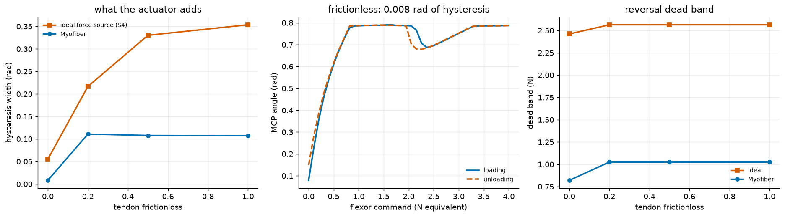

# S16: S4's Finger, Driven by a Braid

S4 characterised a 2-DoF tendon finger driven by *ideal force sources*: the
command was tendon tension in newtons, delivered exactly. This puts a real
actuator behind it. Same finger, same routing, same protocol; the only change
is that tension now comes from a Myofiber whose force depends on its own
length.

It found something about S4 instead.



---

## The port validates exactly

Running the ideal-force-source arm at S4's own settling cap reproduces S4's
published table to three decimals:

| frictionloss | S4 published | this study, ideal arm |
|---|---|---|
| 0.0 | 0.207 | **0.2066** |
| 0.2 | 0.405 | **0.4048** |
| 0.5 | 0.582 | **0.5822** |
| 1.0 | 0.680 | **0.6798** |

Dead bands match too (2.46 / 2.67 / 2.77 / 2.87 N). That is the gate: the
harness is S4's, so anything the Myofiber arm does differently is the actuator.

## Result: S4's numbers are not converged

S4 holds each command until joint velocity falls below a tolerance, or a 4 s
step cap expires. Its README notes that 15 of 79 levels hit the cap and calls
those points "the least trustworthy." It never varied the cap.

Varying it:

| settle cap | width at friction 0.0 | at friction 1.0 | levels unsettled |
|---|---|---|---|
| 2 s | 0.3126 | 0.6872 | 40 |
| **4 s (S4's)** | **0.2066** | **0.6798** | 23 |
| 10 s | 0.1173 | 0.5115 | 10 |
| 30 s | 0.0550 | 0.3536 | 6 |
| 80 s | **0.0315** | **0.1522** | 3 |

**Monotone decreasing at every step, and still falling at 80 s.** The
zero-friction width shrinks **6.6x** between S4's cap and an 80 s one. The
published figures measure how long the sweep waited, not the mechanism.

This matters most for S4's headline conclusion. S4 reported 0.207 rad of
hysteresis at *zero* friction, argued that friction cannot explain it, and
attributed it to snap-through bistability from the extrinsic tendon. The first
half of that argument is right: with no friction the branches must coincide,
so a non-zero width demands an explanation. The trouble is that the width
trends toward zero as the cap grows, which is exactly what frictionless physics
predicts and exactly what incomplete settling looks like.

The snap-through is real and visible in S4's own force-level trace. What is not
established is that it accounts for 0.207 rad, and the number should be treated
as unconverged rather than as a measurement of bistability.

S4's *qualitative* result survives at every cap tested: hysteresis rises
monotonically with tendon friction. That was the study's main claim and it is
robust. The absolute figures in its results table are not.

## Result: compliance suppresses the hysteresis

At every friction value and every settling cap, the braid-driven finger shows
*less* hysteresis than the ideal force source. At a 30 s cap:

| frictionloss | ideal force source | Myofiber | reduction |
|---|---|---|---|
| 0.0 | 0.0550 | 0.0082 | 85% |
| 0.2 | 0.2167 | 0.1108 | 49% |
| 0.5 | 0.3303 | 0.1079 | 67% |
| 1.0 | 0.3536 | 0.1074 | 70% |

The direction is robust to the cap even though the magnitudes are not, which is
what makes it worth reporting when the absolute numbers are not.

The mechanism is the actuator's force-length dependence. An ideal force source
holds its command through a snap; a braid does not, because the snap changes
its length and therefore its force, which opposes the transition. **The
compliance you would normally list as a drawback removes the worst nonlinearity
in a tendon drive.**

## A braid fits a finger and does not fit a hip

S12 found 31 of 50 leg muscles need more excursion than a 30 degree braid can
give, and 17 need more than any braid at all. The finger's tendons need
**26.5%** and **21.3%**, both comfortably inside the 33.3% limit, so no
transmission is required. Worth knowing before choosing where to prototype.

---

## Known limitations, and one that is serious

* **The Myofiber arm does not settle.** At a 30 s cap it leaves 23 to 56 of 79
  levels at the cap, against 6 to 31 for the ideal arm. The actuator closes a
  loop S4 did not have (joint moves, tendon length changes, braid force
  changes, joint moves), and that loop is slower than the protocol allows for.
  **The Myofiber absolute numbers above should be read as upper bounds**, in
  the same way and for the same reason as S4's. The *comparison* between arms
  is sound because both are measured identically at the same cap; the
  individual values are not converged.
* **Fixing it properly needs a different protocol.** Solving the actuator's
  length-force fixed point at each level, rather than integrating to it, would
  remove the dynamics entirely. That is the correct experiment and it is not
  the one run here.
* **One actuator size.** Sized to 4 N peak at supply pressure to match S4's
  sweep range, 1.36 mm radius.

## Two bugs found on the way

**A different statistic, presented as a comparison.** The first version
measured the *maximum* branch separation while S4 measures the *mean* gap over
a trimmed common grid. It reported 0.863 rad against S4's 0.207 for the
identical ideal-actuator case and looked like a finding. Both metrics are
defensible; using one of each and subtracting is not. S4's functions are now
imported rather than reimplemented, which makes the mismatch impossible.

**A five-fold force scale.** Sized initially to the finger's `ctrlrange`
ceiling of 20 N instead of S4's 4 N sweep. At 20 N the finger is pinned against
its joint limits at both ends, so the measured width was the distance between
the limits, 0.937 rad, identical at every friction value. A number that does
not move when the independent variable does is not measuring the independent
variable.

## Reproduce

```bash
python -m s16_myofiber_finger.hysteresis
```

About 4 minutes, most of it the settle-cap convergence sweep. Writes
`media/s16/myofiber_finger.png`, a run log, and a `result.json`.
