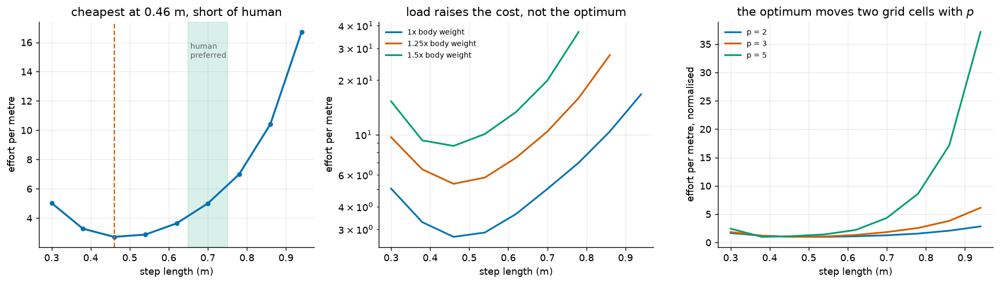

# S17: The Step Length a Muscle-Driven Leg Would Choose

Every study before this took the task as given and asked what the actuators
have to do. This one turns it around: given that muscles cost effort, what
motion is cheapest?

Walking has a well-known answer. Metabolic cost per unit distance is U-shaped
in step length, and humans settle near the bottom of that curve. The hypothesis
was that a purely mechanical effort model, with no metabolism in it at all,
might reproduce both the shape and the location, which would say the preference
is largely mechanical rather than physiological.

**It reproduces the shape and misses the location.** That is the result.



---

## Result 1: the U-shape is real

Quasi-static stance, effort per metre, with the knee and ankle profiles
optimised at every step length rather than assumed:

| step length | cost per metre |
|---|---|
| 0.30 m | 5.03 |
| 0.38 m | 3.28 |
| **0.46 m** | **2.72** |
| 0.54 m | 2.88 |
| 0.62 m | 3.64 |
| 0.70 m | 5.01 |
| 0.86 m | 10.41 |
| 0.94 m | 16.71 |
| 1.02 m | infeasible |

An interior minimum, confirmed. Halving the optimal step costs **1.85x**;
doubling it costs **5.6x**, and past 0.94 m the leg cannot produce the required
torque at all. Short steps pay a per-step overhead many times over; long ones
need large torques at bad postures. Both sides of the classic argument appear,
from mechanics alone.

## Result 2: the optimum is 0.46 m, and humans walk at 0.65 to 0.75

That is the hypothesis failing. The model picks a step roughly **30% shorter**
than people choose, and the gap is far larger than the 0.08 m grid.

The diagnosis is visible in the optimised postures. At every step length the
optimiser drives the knee to its lower bound and keeps it there: the cheapest
quasi-static gait is **stiff-legged**. Which is correct, and is exactly why a
quasi-static model is the wrong tool for this question. A straight knee is
cheap to hold and terrible at absorbing landing shock, clearing the swing foot,
or storing elastic energy, and none of those costs exist in a model with no
dynamics. Real gait bends the knee for reasons this study cannot see, and
bending it makes longer steps relatively cheaper.

So the honest reading is narrow: **quasi-static mechanical effort explains the
shape of the cost curve but not the location of its minimum.** The missing
ingredients are the ones the gait literature already invokes, and they are
dynamic.

## Result 3: the optimum is not robust to the cost exponent

| effort exponent | optimal step |
|---|---|
| p = 2 | 0.54 m |
| p = 3 | 0.46 m |
| p = 5 | 0.38 m |

Two grid cells of movement from a modelling choice that biomechanics has argued
about for forty years (S9-B measured what that exponent does to recruitment).
A prediction that swings with an unsettled parameter is a weak prediction, and
saying so matters more than the central value.

## Result 4: load raises the cost and does not move the optimum

At 1.0, 1.25 and 1.5 body weights the optimum stays at 0.46 m; only the height
of the curve changes. My first version of this check asked whether the loaded
optimum was `<=` the unloaded one, which is **trivially true when they are
equal**, and would have been written up as "carrying load shortens the optimum"
on the strength of an equality. It now reports the shift as a number (0.00 m)
and flags that all three land on the same grid point.

---

## Checks

| check | result |
|---|---|
| Minimum is interior, not at a sweep endpoint | holds |
| Every posture optimisation improved on its start | holds at all 9 feasible lengths |
| Infeasible step lengths excluded, not scored | 2 of 11 excluded |
| Feasible range | 0.30 to 0.94 m |
| Saturation flagged | at and above 0.78 m at least one muscle is pinned at activation 1.0, so the cost rise there is partly saturation rather than efficiency |

## Two bugs found on the way

**Infeasible samples averaged away.** The first version computed the mean cost
over the feasible samples in a step and scaled it up. Long steps then came out
*cheaper than the optimum*, because most of their stance had been quietly
dropped: at 1.05 m only 6 of 9 samples were solvable and the 3 impossible ones
simply vanished from the average. A step is now feasible only if every sample
in it is.

**An objective returning infinity.** With infeasible postures scored as `inf`,
Nelder-Mead's convergence test computes `inf - inf`, which is NaN, and scipy
warns while the simplex wanders. The objective now returns a large finite
penalty that grows with how badly the torque was missed, so the search is pushed
back toward the achievable set, and the reported feasibility still uses the
strict gate. The fix mattered: the optimiser then found postures **6x cheaper**
than the hand-picked profile it started from, which is the whole reason posture
had to be optimised rather than assumed.

## Reproduce

```bash
python -m s17_gait.economy
```

About 15 minutes: five sweeps of eleven step lengths, each running a
Nelder-Mead posture search whose every evaluation is seven inverse-statics
solves.

## Known limitations

* **Quasi-static.** No swing phase, no impact, no elastic return, no
  double-support. Those are precisely the terms that would penalise the
  stiff-legged short-step strategy this study selects, so the missing 0.2 m is
  probably in them.
* **A three-parameter posture family.** Knee midpoint, knee amplitude and ankle
  amplitude. A richer parameterisation could find cheaper motions at every step
  length, and there is no guarantee it would shift them all equally.
* **Clipped parameters are not identifiable.** Once the optimiser pins the knee
  at its bound, the reported knee coefficients wander freely without changing
  the cost. Their values in `result.json` mean "at the limit", not a posture.
* **One leg, no trunk.** The contralateral leg, arm swing and trunk motion all
  cost effort and none are modelled.
