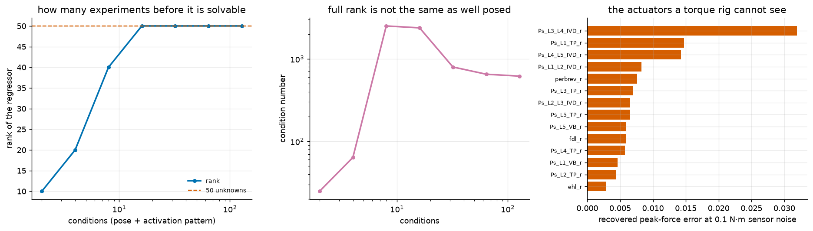

# S18: Could You Calibrate a Fifty-Actuator Limb From Joint Torque Alone?

## The honest scope, first

S5 fitted a simulator to 632 seconds of real robot data. The equivalent here
would be fitting MS-Human-700's muscle parameters to human EMG and motion
capture, and that needs a dataset this repository does not have. Sourcing and
validating one is most of that work, and doing it badly would repeat exactly
the error S5 caught in `nyu_franka_play`: a fit that looks successful because
nothing about it could have failed.

So this asks the question that comes *first*, and needs no external data at
all. **If you instrumented a limb with joint torque sensors and could command
its actuators, which parameters could you actually recover?**

Identifiability is a property of the experiment, not of the estimator. It is
answerable in closed form before anyone builds a rig, and answering it is how
you find out whether the rig is worth building.



---

## The structure

S9 established that joint torque is exactly affine in activation at a fixed
pose, `tau = A a + c`, with `A = R^T G`. Scaling actuator *i*'s peak force by an
unknown factor `s_i` scales the *i*th column of `A`, so

    tau(s) = sum_i s_i A[:, i] a_i = M s,     M[:, i] = A[:, i] a_i

which is **linear in the unknown scale vector**. One condition (a pose plus an
activation pattern) gives 5 equations for 50 unknowns. Stacking conditions
builds a tall system, and identifiability is its rank and conditioning.

Activations are drawn at random rather than set to a fixed pattern. A muscle
that is never activated contributes a zero column and comes out unidentifiable
for a reason that says nothing about the mechanics.

## Result 1: sixteen poses make it solvable

| conditions | rank of 50 | condition number |
|---|---|---|
| 2 | 10 | 25 |
| 4 | 20 | 64 |
| 8 | 40 | 2,507 |
| **16** | **50, full** | 2,378 |
| 32 | 50 | 797 |
| 64 | 50 | 651 |
| 128 | 50 | **618** |

Rank climbs by exactly 5 per condition, which is the number of joints being
measured, until it saturates. That is the arithmetic working as it must, and it
means the experiment is solvable after sixteen poses.

**But full rank is not the same as well posed.** The condition number is at its
*worst* (2,507) right around the point the system becomes solvable, and keeps
improving for another three doublings of effort after rank has stopped changing.
A rig that stopped collecting at sixteen poses would have a technically
identifiable system that amplifies sensor noise about four times more than one
that kept going to 128.

Rank answers "can you". Conditioning answers "how well". They give different
advice about when to stop collecting.

## Result 2: a good dynamometer calibrates the whole limb

Least-squares recovery of all 50 peak-force scales from 128 conditions:

| torque sensor noise | RMS scale error | worst muscle | within 5% |
|---|---|---|---|
| 0 (exact) | **1.1e-14** | 5.1e-14 | 50 / 50 |
| 0.01 N·m | 0.00072 | 0.0032 | 50 / 50 |
| **0.1 N·m** | **0.0072** | **0.032** | **50 / 50** |
| 1.0 N·m | 0.072 | 0.319 | 39 / 50 |

At 0.1 N·m, which is comfortably within a good joint dynamometer, **every one
of the fifty actuators is recovered to better than 3.2%**, and the median far
better. That is an encouraging answer: torque-only calibration of a
many-actuator limb is not just possible in principle, it is practical.

At 1 N·m it degrades to 39 of 50, and the eleven that fall out are the ones
named below.

## Result 3: the actuators a torque rig cannot see

The hardest to recover are the psoas group (`Ps_L1` through `Ps_L5`) and
`perbrev_r`. They share a property: very small moment arms about the five leg
joints being measured. Their contribution to the measured torque is nearly
lost in it, so their scale is inferred from almost nothing.

That is a statement about the *instrumentation*, not the muscles. Measuring
lumbar joints as well as leg joints would put the psoas group back in view.
The result is a specification for where to put sensors, which is what an
identifiability analysis is for.

---

## Checks

| check | result |
|---|---|
| Regressor reproduces the plant at the true parameters | **2.8e-14 N·m** |
| Noise-free recovery is exact | **1.1e-14** RMS |
| Error grows monotonically with noise | holds |
| Error scales linearly with noise | 0.00072 → 0.0072 → 0.072 for 0.01 → 0.1 → 1.0 |
| Rank never exceeds min(5 × conditions, 50) | holds at every count |

The last two are the ones worth pausing on. A least-squares estimator on a
linear system has error exactly proportional to sensor noise, and the measured
errors scale by exactly ten per factor of ten. That is not a coincidence to be
reported as a finding; it is the theory being confirmed, and had it come out
otherwise the estimator would have been wrong. Likewise the rank must grow by
at most the number of independent measurements per condition, and it grows by
exactly five.

## Reproduce

```bash
python -m s18_identifiability.identify
```

About 25 s. Writes `media/s18/identifiability.png`, a run log, and a
`result.json`.

## Known limitations

* **Peak force only.** Optimal fibre length, tendon slack and the activation
  time constants are all identifiable questions too, and harder ones, because
  torque is not linear in them. This is the easy parameter and it is the one
  done here.
* **Static, noise-free poses.** Joint angle is assumed known exactly. A real
  rig has encoder error, and pose error enters through `A`, which is a
  different and messier error path than the additive torque noise modelled
  here.
* **No cross-talk or gravity error.** The offset `c` is assumed known. In
  practice it carries the limb's own weight and any sensor bias, and estimating
  it alongside the scales costs conditioning.
* **The answer is for this routing.** Identifiability is a property of the
  moment-arm structure, so a machine with different tendon paths gets a
  different answer, and would need this analysis run against its own model
  rather than inheriting these numbers.
