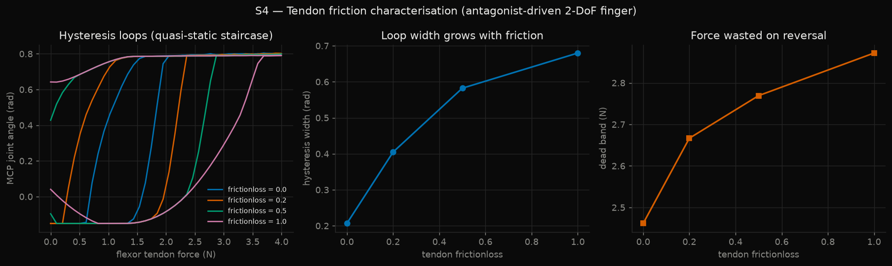

# S4 — Tendon Actuator Modeling in MuJoCo

Clone Robotics lists as a bonus qualification:

> Tendon actuator modeling — MuJoCo tendon actuators, friction identification.

This is that, in simulation. A 2-DoF finger driven by an antagonist pair of
spatial tendons, with friction, hysteresis, and reversal dead band measured
under a quasi-static protocol.



---

## Results

| frictionloss | hysteresis width (rad) | dead band (N) | max flexion (rad) |
|---|---|---|---|
| 0.0 | 0.207 | 2.46 | 0.804 |
| 0.2 | 0.405 | 2.67 | 0.804 |
| 0.5 | 0.582 | 2.77 | 0.799 |
| 1.0 | 0.680 | 2.87 | 0.791 |

Both hysteresis width and dead band increase monotonically with tendon
friction, which is the expected physical behaviour and the check that the
model is sound.

---

## The finding worth talking about

**At zero friction the hysteresis width is 0.207 rad, not zero.**

That should be impossible — with no friction the loading and unloading
branches must coincide. Tracing the individual force levels explains it:

```
 force   mcp loading   mcp unloading
  1.03     -0.150         +0.553      <- already snapped up
  1.54     -0.148         +0.785
  2.05     +0.790         +0.789      <- snaps up here on loading
```

The finger **snaps between two stable configurations**, and the snap happens
at a different force depending on direction: it jumps up at ~2.05 N while
loading, but does not fall back until ~1.03 N while unloading.

This is *snap-through bistability*, and it is a direct consequence of
under-actuation. The flexor is an extrinsic tendon spanning both joints — the
same arrangement as the long flexors in a human finger — so the two joints
cannot be commanded independently. When the distal joint reaches its limit the
whole mechanism's equilibrium shifts discontinuously.

So the measured hysteresis has two distinct sources:

* **geometric** (0.207 rad, present at zero friction) — bistability from
  under-actuation
* **frictional** (the increase above that baseline) — up to 0.47 rad at
  frictionloss = 1.0

They matter differently for control. Friction hysteresis can be reduced with
better tendon routing or compensated with a friction model. Bistability
cannot — it is intrinsic to the kinematics, and a controller has to plan
around it or the finger will jump between configurations under smooth
commands.

---

## Three bugs found on the way

All three silent under plain MuJoCo. All three worth knowing about.

### 1. Tendon sign convention needs routing *and* gear to agree

MuJoCo applies `qfrc = J^T · (gear · ctrl)` where `J = d(tendon_length)/dq`.
A positive actuator force therefore acts along **increasing** tendon length —
it pushes. A real tendon can only pull, so `ctrl ≥ 0` requires `gear = -1`.

But that alone is not enough. The routing (which side of the joint the sites
sit on) sets `sign(J)`, and the *product* decides which way the joint moves.
The first two attempts each got one half right and the finger crept to the
wrong joint limit, compiling and running without complaint the entire time.

Measured final values: flexor `J = -0.0091`, `gear = -1`, giving
`qfrc = +0.109 N·m` → flexion. Verify by printing `data.ten_J` and stepping
the sim. Do not reason about it from the XML.

### 2. Wrap geoms were colliding with the base

The routing pulleys are tendon *wrap surfaces*, not physical bodies, but they
were left in collision detection by default. They pushed against the base and
phalanges, adding contacts with no physical counterpart.

The effect was real but modest: setting `contype=0 conaffinity=0` dropped the
zero-friction hysteresis baseline from 0.253 to 0.207 rad (~18% of it was
phantom contact) and made the dead-band trend cleanly monotonic, where it
previously had a flat spot between frictionloss 0.0 and 0.2.

Found only because MJX refuses cylinder-box collisions and failed loudly on
`mjx.put_model`. Plain MuJoCo accepted it silently. Porting to a second
backend is a surprisingly effective model-validation technique.

### 3. A 0.25 Hz sinusoid is not quasi-static

The first protocol drove the tendon sinusoidally and measured loop width. It
reported 0.314 rad at zero friction and — worse — the width **decreased** as
friction increased.

That was dynamic phase lag, not friction. The joint was lagging the drive
because of inertia and viscous damping. Adding friction reduced the motion
amplitude, which reduced the lag, which shrank the apparent hysteresis. The
artifact ran exactly backwards from the physics.

The fix was to remove dynamics from the measurement entirely: step the force
and wait for the joint to settle before recording. This is also how the
measurement is done on real hardware, for the same reason.

A related early error: measuring *enclosed area* rather than *loop width*.
Area is confounded by amplitude, so it fell as friction rose even while the
loop widened.

---

## Model

`finger.xml` — 2 DoF (MCP, PIP), antagonist flexor/extensor spatial tendons,
cylinder wrap geoms with explicit `sidesite`, 1 kHz timestep.

Details that matter:

* **`<spatial>` tendons, not `<equality>` constraints.** An equality
  constraint gives kinematically correct coupling with none of the compliance
  or hysteresis that dominates real tendon hardware.
* **`sidesite` is mandatory on geom wraps.** Without it MuJoCo picks a wrap
  direction arbitrarily, and picking wrong flips the sign of the moment arm.
* **Only spheres and cylinders can be wrap geoms.** Meshes cannot.
* **`ctrlrange` starts at 0** on both actuators — tendons pull or go slack,
  never push.

---

## Reproduce

```bash
python -m s4_tendon.hysteresis
```

Writes `media/s4/hysteresis.png` and a JSONL run log under `runs/`, including
a hash of the compiled model so results can be tied to the exact MJCF that
produced them.

## Known limitation

15 of 79 force levels did not reach the settling tolerance within the 4 s cap,
all of them at the snap transitions where the mechanism genuinely oscillates
before landing. Those points are the least trustworthy in the sweep. The run
log records the count (`n_unsettled`) rather than hiding it.
