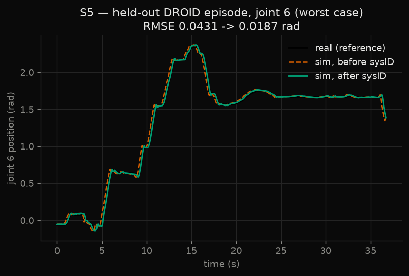
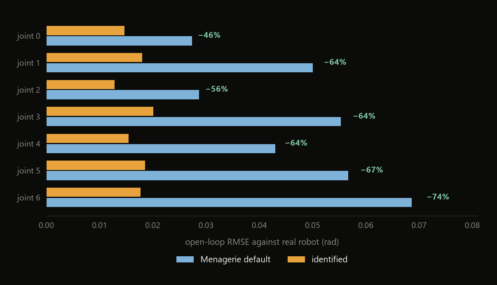
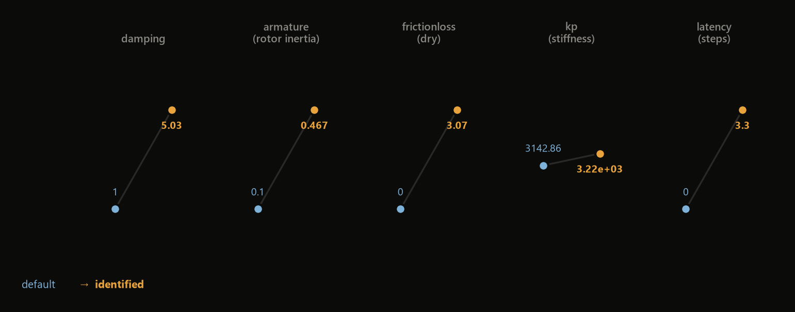
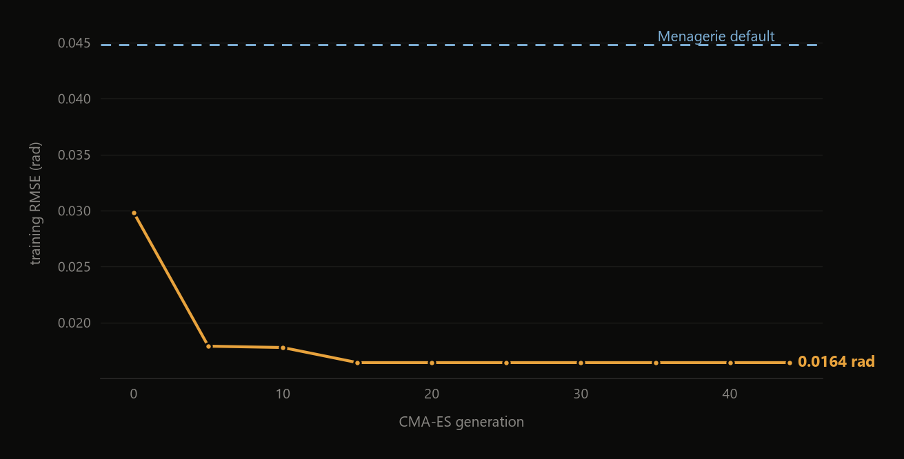

# S5 — Real-to-Sim System Identification

Fitting MuJoCo's Franka Panda to 632 seconds of logged motion from a physical
robot, and reporting the error on episodes the optimiser never saw.



## Result

| | open-loop RMSE vs real robot |
|---|---|
| Menagerie default | 0.04308 rad |
| **Identified** | **0.01865 rad** |
| | **56.7% reduction, held out** |

Per joint the reduction ranges from 46% to 74%, largest at the wrist, where
light distal links make friction and latency dominate.



## Why the split is the whole methodology

Parameters were fitted on **24 episodes** and scored on **8 the optimiser never
touched**.

The split is by *episode*, never by frame. Frames inside one trajectory are
heavily correlated, so a frame-level split leaks the answer into the training
set and the held-out number becomes meaningless. Episodes were shuffled before
splitting because DROID groups recordings by building and collector, and an
unshuffled split would correlate the test set with a specific lab.

Fitting and reporting on the same trajectories is overfitting a simulator. With
enough free parameters you can match any finite set of trajectories exactly, and
the result tells you nothing about the next one.

## The measurement

DROID logs two signals that most robot datasets conflate:

```
action.joint_position             what the controller was COMMANDED
observation.state.joint_position  where the robot actually WENT
```

They are never equal — mean |commanded − measured| is 0.0388 rad across these
episodes, peaking at 0.255 rad. That difference is the physical signature of
friction, rotor inertia, finite controller stiffness, and communication delay.

The protocol replays the real commanded positions **open-loop** through the
simulator. The sim is initialised from the robot's first measured state and
then never sees ground truth again, so errors accumulate exactly as they would
on hardware. That is a much harder test than closed-loop, where the reference
continuously drags the simulation back on track.

## What the identified parameters say



| parameter | default | identified | reading |
|---|---|---|---|
| `damping` | 1.0 | 5.03 | viscous friction 5× higher |
| `armature` | 0.10 | 0.467 | rotor inertia ~5×; harmonic drives multiply reflected inertia by the square of the gear ratio |
| `frictionloss` | 0.0 | 3.07 | **dry friction exists**; the shipped model has none |
| `kp` | 3143 | 3218 | controller stiffness roughly correct already |
| `latency_steps` | 0.0 | 3.30 | **≈220 ms** of delay at 15 Hz |

The two large findings are that Menagerie ships the Panda with zero Coulomb
friction and zero latency, and the data disagrees emphatically about both. `kp`
barely moved, which is a useful negative result — the shipped stiffness was
already right, and the error was coming from elsewhere.

Five parameters are shared across all seven joints rather than fitted per joint.
With 632 s of data, 35 free parameters would overfit comfortably; 5 is a claim
the data can support. Per-joint fitting is the natural extension given more
data, and `build_model()` is structured so that is a small change.



## The dataset that had no answer in it

The first attempt used `lerobot/nyu_franka_play_dataset`. Its `action` column
turned out to be exactly `state[t+1] − state[t]`:

```
corr(action[k], Δjoint[k])  =  1.0000   on all 7 joints
action_std                  =  dstate_std  to the last digit
```

The "commands" were relabelled state differences. That dataset is kinematically
self-consistent by construction and contains no reality gap at all — nothing in
it was ever measured independently of anything else.

Fitting a simulator to it would have produced a near-perfect result that meant
nothing, and no part of the process would have flagged it. A perfect fit is
usually evidence of a broken measurement rather than a good model.

`verify_dataset_has_gap()` now runs before the optimiser and raises if
commanded and measured are not independent signals — checking both
`cmd == meas` and `cmd[t] == meas[t+1]`.

## Data

32 episodes from `cadene/droid_1.0.1`, chunk 000 — 9,475 frames at 15 Hz,
632 seconds of real Franka Panda motion, 3.9 MB. Not vendored;
`scripts/fetch_assets.sh` retrieves them.

## Reproduce

```bash
bash scripts/fetch_assets.sh
python -m s5_sysid.fit --iterations 45
```

Writes `media/s5/sysid_before_after.png`, `identified_params.json`, and a JSONL
log whose first line records the seed, git SHA, library versions, and the
train/test split.

## Honest limitations

- **15 Hz sampling** is coarse for identifying dynamics that act on
  millisecond timescales. The latency estimate is quantised to 67 ms steps.
- **Five shared parameters** cannot capture per-joint variation that certainly
  exists on real hardware.
- **Gripper and payload are ignored.** Both affect the dynamics and neither is
  modelled here.
- **One chunk of DROID.** These episodes come from a limited set of buildings
  and collectors; a broader sample might identify different values.
