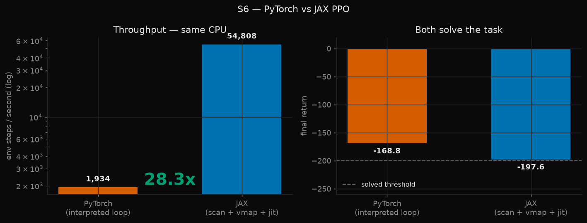

# S6 — PPO in JAX

A second PPO implementation, in JAX rather than PyTorch, trained on the same
task so the port can be validated against a result that already exists.



## Result

| | PyTorch | JAX |
|---|---|---|
| program shape | interpreted Python loop | `lax.scan` + `vmap` + `jit` |
| throughput | 1,934 steps/s | **54,808 steps/s** |
| final return | −168.8 | −197.6 |
| solved (≤ −200) | yes | yes |

**28.3× faster on the same CPU**, with both implementations solving the task.

No GPU is involved in that number. It measures the benefit of the *program
shape* alone — a compiled loop over 512 vectorised environments versus an
interpreted loop over one. A GPU number would be strictly larger and is not
claimed here, because this machine does not have one.

JIT compilation costs 1.2 s once and is excluded from the throughput figure;
including it would flatter any run longer than a few seconds.

## Why this matters beyond the benchmark

In-hand manipulation (S2) needs on the order of 10⁸ environment steps. At the
PyTorch implementation's 1,934 steps/s that is about 14 hours of pure
environment stepping before any learning is counted. This is why S6 is a
*prerequisite* for S2 rather than an optional extra — and on GPU with MJX the
gap widens by another order of magnitude.

## The two bugs

### 1. The same reward-scaling bug, reproduced exactly

The first JAX version did not learn: flat at ~−1200 while running at 196k
steps/s. Identical symptom to the PyTorch implementation's first version.

Both had the same cause — no reward scaling, so a value loss of ~10⁶ against a
policy loss of ~10⁻² monopolised the clipped global gradient norm.

That the bug reproduced independently in a completely different framework is
itself evidence the two implementations agree. Fixed the same way: divide
rewards by the standard deviation of the discounted-return accumulator, never
subtract the mean.

### 2. Truncation bootstrapping, made harder by autoreset

Pendulum has no terminal state — every episode end is a time-limit truncation,
so the value must always be bootstrapped.

In a vectorised JAX rollout the environment autoresets *inside* the scan, so
`values[t+1]` on a truncated step is the value of a freshly reset episode
belonging to a different trajectory. Using it as the bootstrap is wrong, and
it is invisible unless you deliberately capture the value of the true next
state before the reset overwrites it.

The fix computes `boot_val` from the pre-reset state and feeds it to GAE:

```python
nv = jnp.where(trunc, boot, next_value)
delta = reward + gamma * nv - value_t
gae = jnp.where(trunc, delta, gae)   # accumulator still resets
```

The accumulator reset and the value bootstrap are two separate decisions.
Conflating them is the standard version of this bug.

## Implementation notes

- **No `flax`.** It cannot be installed on this machine — its `orbax`
  dependency ships test fixtures whose paths exceed the Windows `MAX_PATH`
  limit. Networks are plain JAX pytrees; `optax` handles the optimiser. For a
  two-layer MLP a network library buys nothing anyway.
- **Environment matches Gymnasium's `Pendulum-v1` exactly**, including
  semi-implicit Euler integration (θ updated with the *new* θ̇). Getting that
  wrong would make the cross-implementation comparison meaningless.
- **Same hyperparameters where they transfer**: orthogonal init with gains
  √2 / 0.01 / 1.0, state-independent `log_std`, per-minibatch advantage
  normalisation, entropy coefficient 0.
- **MJX verified separately** — `mjx.put_model` steps the S4 tendon finger on
  this machine, so the path to GPU-parallel MuJoCo is confirmed open.

## Reproduce

```bash
python -m s6_brax_jax.train --total-steps 8000000 --num-envs 512
```
