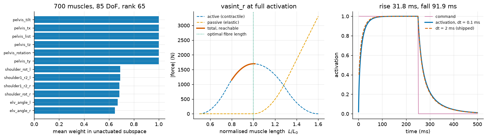
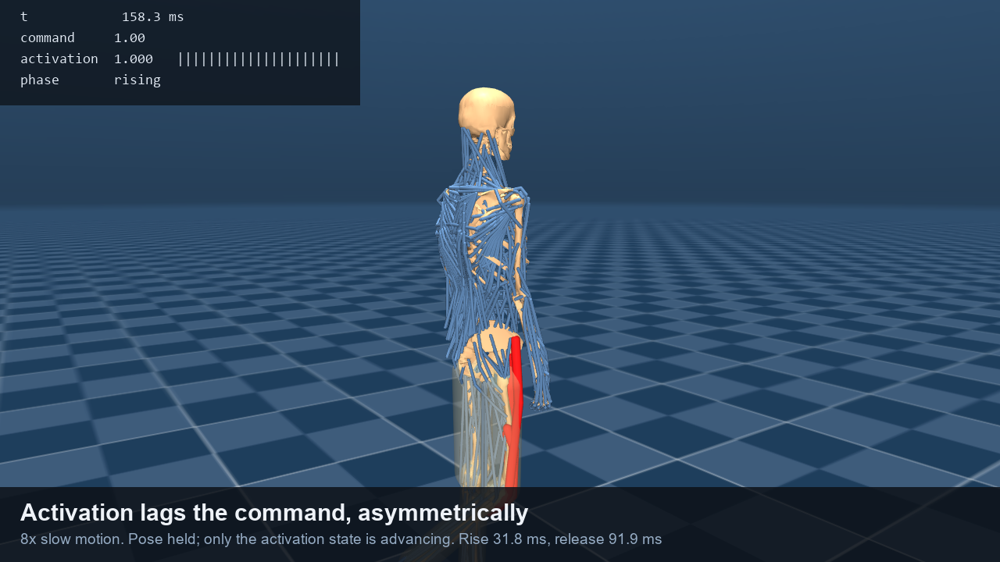
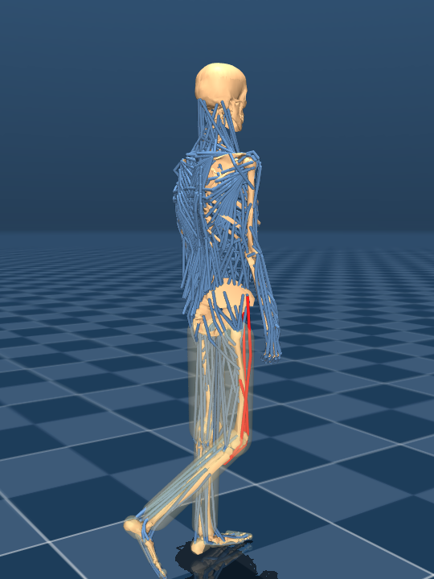
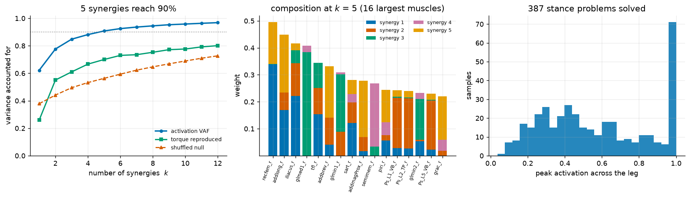
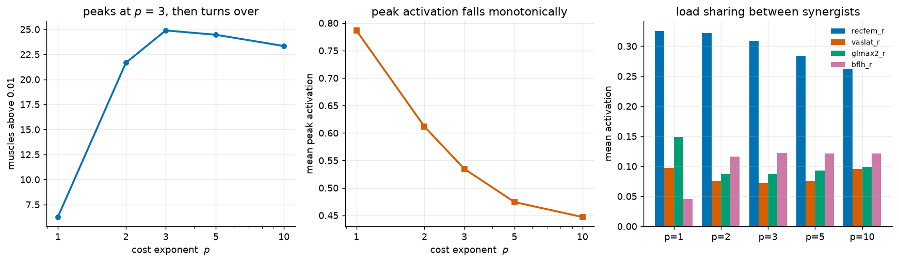
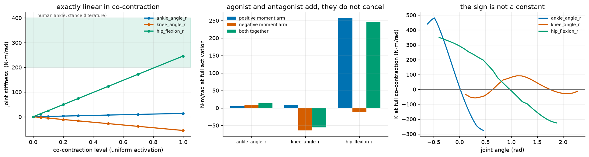
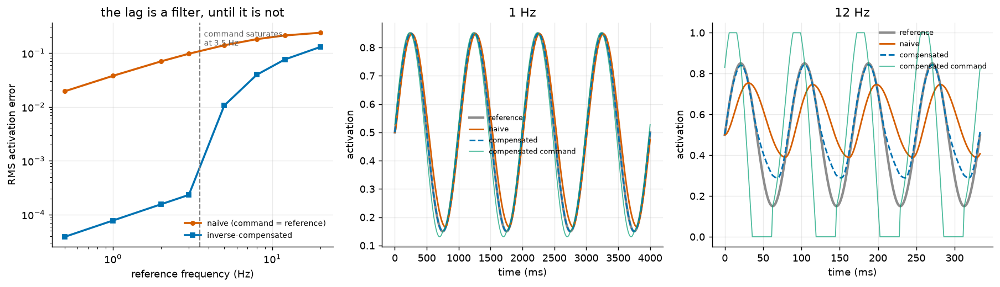
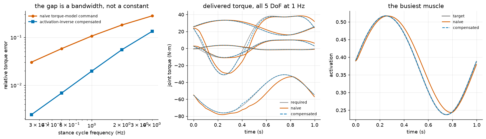
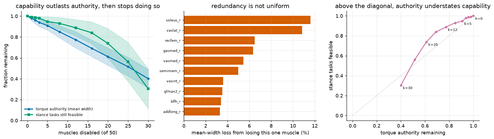

# S9: Muscle Actuation (MS-Human-700)

Every other humanoid in MuJoCo Menagerie is torque-actuated: one motor per
joint, force commanded directly, available torque independent of pose. Clone
Robotics' Myofiber is none of those things. It pulls only, its force depends on
its own state, and there are many more actuators than degrees of freedom.

MS-Human-700 is the closest publicly available model with the same three
properties: **700 Hill-type muscle actuators over 85 DoF**, all pull-only
(`ctrlrange` `[0, 1]`), all routed through spatial tendons. This is not a model
of Protoclone and nothing here claims it is. It is a testbed for the control
problems muscle-like actuation creates regardless of whether the contractile
element is protein or a pneumatic bladder.

S4 measured tendon friction on a 2-DoF finger. This is the same class of
problem at whole-body scale, with the actuator model included rather than
idealised away.



## Film

[**media/s9/s9_muscle.mp4**](../media/s9/s9_muscle.mp4) is a 21-second
walkthrough of the four results below. Every number on screen is read out of
the simulation as it runs.

[](../media/s9/s9_muscle.mp4)

| segment | shows | mode |
|---|---|---|
| The body | 700 actuators, 85 DoF, colour convention (blue idle, red active) | static |
| Moment arms move with the pose | joint sweep, tendons tinted by \|moment arm\|; 22 muscles reach the knee, `vasint_r`'s arm moving 57.0 mm to 30.6 mm | kinematic |
| Activation lags the command | 8x slow step response; 31.8 ms to rise, 91.9 ms to release | activation state only, pose held |
| No activation pattern holds the body up | relaxed body against one at 50% co-contraction, both released under gravity | full dynamic rollout |

Segment 3 advances only the activation state, using the same RK4 integration of
`mju_muscleDynamics` that `characterize.py` validates the simulator against.
The pose is held because a free-standing model driven by one muscle group
collapses in well under half a second, and the collapse is what segment 4 is
for. The recruited group is drawn three times wider than the model's 5 mm
tendon width, which affects rendering only.

```bash
python -m s9_muscle.film          # 1280x720, ~80 s
```

### Study films

One clip per study, in `media/s9/`. Each is driven by the same code that
produces the published numbers, so the on-screen readouts are measurements
rather than captions.

| film | length | what it shows |
|---|---|---|
| [film_synergies.mp4](../media/s9/film_synergies.mp4) | 22 s | the 5 extracted synergies one at a time (each an anatomically coherent group: synergy 1 is the hip abductors, 23% of total drive), then a loading cycle rebuilt from them with the torque error read out live |
| [film_redundancy.mp4](../media/s9/film_redundancy.mp4) | 12 s | one identical stance problem solved at p = 1, 2, 3, 5, 10, recruitment visibly spreading from 5 muscles to 26 as the exponent rises |
| [film_impedance.mp4](../media/s9/film_impedance.mp4) | 10 s | the stiffness sign flipping as the knee sweeps its range, then two release tests side by side: at K = +105 the joint returns (0.002 rad drift), at K = -58 it runs away (0.557 rad) under the identical command |
| [film_transfer.mp4](../media/s9/film_transfer.mp4) | 6 s | a 1 Hz stance cycle commanded naively against the same cycle pre-inverted, with the torque error on both |
| [film_failure.mp4](../media/s9/film_failure.mp4) | 9 s | muscles going limp one at a time, torque authority and task feasibility falling with them, and the moment the pose can no longer be held |

```bash
python -m s9_muscle.films              # all five, ~3.5 min
python -m s9_muscle.films --only impedance
python -m s9_muscle.films --draft      # 640x360 composition check
```

Three rendering decisions worth naming, all cosmetic and none touching
dynamics. Geom group 1 is 14 translucent skin sleeves over the limbs; at 0.2
alpha over a dense tendon bundle they wash a close shot to grey, so the films
hide them (`film.py` keeps them, its shots being wide enough to benefit). The
leg's tendons are drawn 3x wider so a 50-muscle subset reads at whole-body
scale. And the idle colour is a dark navy rather than the blue used elsewhere,
because these clips have to communicate an activation *level* at a glance and
a mid-range value against a bright idle reads as muddy violet.

The impedance release test is a reduced model and is labelled as one on screen:
one degree of freedom, the rest of the body held, an external load holding the
joint at equilibrium so that the only thing acting after the 0.06 rad nudge is
the change in muscle torque. A free-standing body would collapse for reasons
that have nothing to do with the joint under test.




---

## Model

| | |
|---|---|
| Actuators | 700, all `muscle` dyntype / gaintype / biastype, all tendon transmission |
| DoF | 85 (13 slide, 72 hinge), 81 bodies, 42 equality couplings |
| Mass | 60.2 kg |
| Command range | `[0, 1]` on every actuator: activation, not signed torque |
| Peak isometric force | 25.9 N to 6194.8 N per muscle, 206.6 kN summed |
| Activation constants | `tau_act` 10 ms, `tau_deact` 40 ms |
| Timestep | 2 ms as shipped |

Source: MS-Human-700 by the [LNS Group](https://lnsgroup.cc/research/MS-Human),
vendored through MuJoCo Menagerie. Requires MuJoCo >= 3.2.6; measured on 3.11.0.

---

## Results

### 1. The body is 700-actuator redundant and 20 DoF underactuated

The moment-arm matrix `R = d(length)/dq` has **rank 65 at all 24 sampled
poses**, out of 85 DoF. Two numbers follow:

* **635-dimensional activation null space.** Activation is not recoverable from
  joint torque. Enormously many activation patterns produce identical motion
  and differ only in co-contraction, which is to say in stiffness. A policy
  that outputs joint torque has thrown that channel away before it starts.
* **20 joint-space directions no activation pattern can drive.**

Those 20 are not scattered. Six carry weight exactly 1.0, meaning they lie
entirely in the unactuated subspace, and they are the six pelvis DoF: the
floating base. The rest are the shoulder-girdle and knee DoF that the model
drives through its 42 equality couplings rather than through muscle.

**External check.** Muscles are internal forces, so no activation pattern may
produce net force on the base. Across random activation vectors the largest
generalised force on the three base translation DoF is **0.0 N**, exactly. That
is Newton's third law, not a fit; a non-zero result would have invalidated
everything below it.

### 2. Available joint torque varies 1.33x across one joint's own range

Holding `vasint_r` at full activation and sweeping `knee_angle_r` across its
entire range:

| | |
|---|---|
| Muscle force | 1143 N to 1698 N (**1.49x**) |
| Moment arm | 30.6 mm to 57.0 mm (**1.86x**) |
| **Joint torque** | **52.0 N·m to 69.3 N·m (1.33x)** |

Command is constant. Everything else moves. On a geared motor that last row is
a flat line.

> **Corrected.** The first version of this table read 1.74 mm to 59.0 mm and a
> 26.6x torque swing. Those numbers were computed with the model's 42 equality
> couplings violated; see the equality-projection bug below. The effect is real
> but an order of magnitude smaller than first reported.

**External check.** `data.actuator_force` from the simulator agrees with
`mju_muscleGain * act + mju_muscleBias` evaluated independently to **0.0 N**
maximum absolute error. The active element peaks at normalised length **0.999**
where the Hill model defines optimal fibre length to be 1.0, and passive force
at the optimum is **0.0 N**, as it should be.

**A trap in the plot.** Total force keeps rising past the optimal length, so a
naive force-vs-length curve looks nothing like a Hill curve and invites the
conclusion that the model is wrong. It is not: past `L/L0 = 1` the passive
elastic element grows fast enough to bury the active element's descending limb.
The middle panel above plots them separately for that reason.

The knee's own limits only expose `L/L0` in `[0.798, 1.015]` of the modelled
`[0.5, 1.6]`. **The descending limb is unreachable in this model**, so
in-simulation force is monotone in length even though the underlying muscle
model is not.

### 3. Deactivation is 2.9x slower than activation, and the shipped timestep cannot resolve either

Step the command 0 to 1 and back:

| | |
|---|---|
| Declared `tau_deact / tau_act` | 4.0 |
| Measured 10-90% rise | 31.8 ms |
| Measured 90-10% fall | 91.9 ms |
| **Measured ratio** | **2.89** |

The measured ratio is not the declared ratio, and should not be expected to be.
MuJoCo's muscle dynamics are not a plain first-order lag: the time constant is
itself a function of activation (`tau_act * (0.5 + 1.5a)` rising,
`tau_deact / (0.5 + 1.5a)` falling), so a 10-90% window integrates over a
changing time constant. The asymmetry is the transferable part. Roughly 90 ms
to release is latency no controller can command away, and it is the same
problem a valve-actuated system has when venting is slower than filling.

---

## The finding worth talking about

**The model's shipped timestep misintegrates the fastest state in the model by
15% of full scale.**

Activation is advanced by explicit Euler at the model timestep. MS-Human-700
ships with `timestep = 0.002`, and the fastest activation time constant is
`tau_act * 0.5 = 5 ms`. The step is 40% of the time constant of the fastest
state in the system.

Sweeping the timestep against RK4 at 0.02 ms:

| timestep | max abs error vs RK4 | 10-90% rise | 90-10% fall |
|---|---|---|---|
| **2.0 ms (shipped)** | **0.150** | not measurable | not measurable |
| 1.0 ms | 0.050 | not measurable | 90.5 ms |
| 0.5 ms | 0.021 | not measurable | 91.3 ms |
| 0.2 ms | 0.0077 | 31.6 ms | 91.8 ms |
| 0.1 ms | 0.0038 | 31.8 ms | 91.9 ms |

At 2 ms the first integration step takes activation from 0 to about 0.4,
straight past the 10% level. The 10-90% rise time is not merely inaccurate at
the shipped timestep, it is **unbracketed**: there is no sample between 0.1 and
0.4 to interpolate, so the quantity does not exist in the data.

This is not a bug in the model. 2 ms is a reasonable choice for contact
stability in a 348-geom body, and the error is in a state that mostly gets
low-pass filtered by the body's own inertia. It matters when the activation
trajectory is itself the object of study, which it is for anything doing system
identification against real actuator step responses, and it is exactly the kind
of discrepancy that gets attributed to the reality gap when it originated in
the integrator.

---

## Six control studies

The characterisation above describes the plant. These six ask what you can do
with it. All of them run on the right leg's **50 muscles over 5 DoF**, and all
rest on one verified fact: at a fixed pose and zero velocity, muscle force is
*exactly* affine in activation.

    actuator_force = gain(pose) * act + bias(pose)      max error 0.0 N
    qfrc           = R(pose)^T @ actuator_force         max error 1.8e-12 N·m

That turns "which of 50 muscles do you fire" into a linear system with box
constraints, and every study below is a different question about that system.
The check is re-run and logged at the start of each one.



### A. Synergies: 5 patterns cover 90% of activation, and 70% of the torque

`python -m s9_muscle.synergies`

387 stance problems (posture x ground-reaction force, solved by inverse
statics), each solved for minimum-effort activation, then factorised with NMF.

| | |
|---|---|
| Synergies for 90% activation VAF | **5** |
| Synergies for 95% | 9 |
| Shuffled-null control at k = 12 | 0.727, never reaches 90% |
| **Torque actually reproduced at k = 5** | **0.70** |

Five lands squarely in the four-to-six range reported for human leg EMG during
walking. That is a convergence of two different things, not a reproduction:
this measures the dimensionality of the *effort-optimal solution manifold*, not
neural control.

**The finding is the gap between the two curves.** 90% of activation variance
is 70% of the torque. Activation-space VAF is the metric the synergy literature
uses, and on this plant it substantially overstates functional adequacy: muscle
gains span 25 N to 6200 N, so a small activation error on a strong muscle is a
large torque error. Score a compressed controller on what it delivers, not on
what it explains.

The shuffled-null control matters as much. NMF fits almost anything given
enough components; permuting each muscle's activations independently preserves
every marginal and destroys the between-muscle structure, and the same
procedure then cannot reach 90% at any rank tested.



### B. Redundancy resolution: what the effort exponent decides

`python -m s9_muscle.redundancy`

The same stance problems solved at `min sum(a^p)` for five exponents.

| p | muscles recruited | mean peak activation | total activation | at a bound |
|---|---|---|---|---|
| 1 (LP) | 6.3 | 0.787 | 3.04 | 90% |
| 2 | 21.7 | 0.612 | 3.95 | 47% |
| 3 (Crowninshield-Brand) | 24.9 | 0.535 | 4.87 | 47% |
| 5 | 24.5 | 0.474 | 5.87 | 44% |
| 10 | 23.3 | 0.447 | 6.42 | 37% |

Two properties follow from the optimisation rather than from the model, and
both hold at every exponent: peak activation falls monotonically, total
activation rises monotonically. p = 1 behaves exactly as an LP must, putting
90% of its activations at a bound and using about 6 muscles, one more than the
5 DoF being controlled.

**Muscle count is not monotone.** It peaks at p = 3 and falls again as the
objective approaches min-max. That is the quantity most commonly quoted, and it
turns over in the middle of the range people argue about.



### C. Co-contraction is not a stiffness knob

`python -m s9_muscle.impedance`

Joint stiffness `K = -dtau/dq` by central difference, against co-contraction
level and against joint angle.

| joint | K over the joint's travel | fraction negative | sign changes |
|---|---|---|---|
| ankle | -276 to **+481** N·m/rad | 40% | 1 |
| knee | -58 to +92 N·m/rad | 48% | 2 |
| hip | -225 to +350 N·m/rad | 40% | 1 |

Stiffness is *exactly* proportional to co-contraction level (deviation below
1e-4, which follows from force being affine in activation), and the two sides
of each joint add rather than cancel. Both checked.

**But the sign changes with joint angle at every joint.** Over roughly 40% of
each joint's range, uniform co-contraction makes the joint *easier* to
displace. "Co-contract to stiffen up" is standard practice in robot impedance
control and it does not survive contact with this model.

This one caught me out. The first version measured one neutral angle per joint,
got 13.6 N·m/rad at the ankle against a human literature band of 200 to 400,
and concluded the model was 15x too compliant. The number was right and the
conclusion was wrong: that pose sits almost exactly on the ankle's zero
crossing, and 481 N·m/rad is available elsewhere in the same range. **A
single-pose stiffness comparison against literature can produce any answer you
want on this model.**

Why the sign moves: `tendon_stiffness` is zero for all 700 tendons, so there is
no series elasticity. That leaves only the force-length slope (always
stabilising) and the moment-arm derivative (either sign), and with the first
small the second decides.



### D. Cancelling the activation lag, and the wall behind it

`python -m s9_muscle.latency`

The 32/92 ms lag is an invertible first-order filter, so most of it is not a
physical limit. Inverting it in closed form:

    u = a + a_dot * tau_act  * (0.5 + 1.5a)      rising
    u = a + a_dot * tau_deact / (0.5 + 1.5a)     falling

| | |
|---|---|
| Inverse verified against `mju_muscleDynamics` | **2.8e-14** max rate error, 1600-point grid |
| Predicted saturation frequency | **3.5 Hz**, closed form |
| RMS error reduction below saturation | **418x to 504x** |
| RMS error reduction above | 13x, 4.6x, 2.8x, 1.8x |

The closed-form prediction and the simulation agree exactly: no tracking run
below 3.5 Hz saturates its command, every run at or above it does. Below the
wall the lag is a controller problem worth about 500x. Above it, the command is
pinned at 1.0 and no controller helps.



### E. A torque-model command loses 10.6% of the torque at walking cadence

`python -m s9_muscle.transfer`

The claim the whole project gestures at, made into a number. A stance cycle is
tracked three ways: an ideal torque actuator (exact by construction), a muscle
plant commanded with the activation that would produce the required torque, and
the same targets pre-inverted through the activation dynamics.

| cycle frequency | naive relative torque error | compensated | improvement |
|---|---|---|---|
| 0.25 Hz | 3.0% | 0.24% | 12.5x |
| 0.5 Hz | 5.8% | 0.68% | 8.5x |
| **1 Hz (walking)** | **10.6%** | **2.0%** | **5.4x** |
| 2 Hz | 18.1% | 5.5% | 3.3x |
| 4 Hz | 28.1% | 13.3% | 2.1x |

The redundancy solve is correct at every instant, so the target activation is
right. What is wrong is that commanding `a*` produces a low-pass filtered `a*`,
and the plant multiplies that by a matrix that does not commute with the
filter. The error vanishes as the reference slows, which is the check that this
is a bandwidth limit and not a bug.

**External check:** torque computed through the linearised plant matches
MuJoCo's own `qfrc_actuator` for the same activation at the same pose to
**1.4e-14 N·m**, end to end.



### F. Actuator failure: two measures that disagree, then swap

`python -m s9_muscle.failure`

Muscles are disabled in nested random sets. A failed muscle goes limp: its
column of `A` is zeroed, its passive bias stays in `c`.

| muscles dead | torque authority | stance tasks feasible |
|---|---|---|
| 5 (10%) | 90.9% | 94.8% |
| 12 (24%) | 77.3% | 88.8% |
| 20 (40%) | 61.2% | 73.9% |
| 30 (60%) | 40.1% | 30.4% |

Capability outlasts raw authority up to about 25 dead muscles, because real
tasks sit well inside the achievable set. Past that it falls faster, because
what is left of the set stops covering the directions the tasks need. Mean
torque authority is reassuring early and misleading late, which is the wrong
way round for a number you would use to set a maintenance interval.

**Redundancy is not uniform.** Losing `soleus_r` alone costs 11.6% of mean
torque authority, `vaslat_r` 10.8%. Two muscles out of fifty account for over a
fifth of it.

Checks: the closed-form support bound was verified against 4000 random
activations in 24 directions (never exceeded, attained exactly by the vertex
activation, gap 1.1e-13); removing any single muscle never enlarges the set;
and both curves are monotone within every one of the 24 nested trials.
Monotonicity is checked *within* trials rather than on the means, because means
over independently drawn subsets need not be ordered, and checking those would
test the sampler rather than the physics.

---

## Three bugs found on the way

All silent. All produced confident, wrong output.

### 1. A NaN that was telling the truth

The first pass reported `NaN` for rise and fall times. The obvious fix, and the
one first applied, was to make the crossing detector return the first sample
time when the level was already exceeded at sample zero. That turned NaN into
`25.9 ms`, which is a plausible-looking number, sits neatly beside the
converged 31.8 ms, and is **entirely an artifact of the step size**. It is
`t(0.9) - dt`, with the 10% crossing never observed.

The NaN was the correct output. `_crossing` now returns NaN whenever the level
is not bracketed, including at the first sample, and the sweep reports null
rather than a number it did not measure.

### 2. Actuator index is not tendon index

Colouring muscles by activation means writing `model.tendon_rgba`, since MuJoCo
does not do it on its own (measured: toggling `mjVIS_ACTUATOR` or the
`rgba.actuatorpositive` visual default changes exactly zero pixels, and the
tendons carry no material to override).

Activation is indexed by actuator. `tendon_rgba` is indexed by tendon. Both
have length 700 here, so `tendon_rgba[i] = f(act[i])` compiles, runs, and
renders a picture that is wrong in a way nothing flags: the orderings are a
non-trivial permutation, with actuator 0 driving tendon 11. The first
recruitment render highlighted a strip of shin while the quadriceps it had
actually activated stayed blue. Go through `actuator_trnid`.

Related, and the reason the sign convention is verified rather than assumed:
`knee_angle_r` ranges `[0, 2.4]` with 0 fully extended, so extensors have
*positive* moment arm here. Confirmed by stepping the sim: `vasint_r`
(`r = +0.059`) drives `qacc[knee]` negative. This is the same lesson as S4's
tendon sign bug, and it is still cheaper to measure than to reason about.

### 3. Equality-coupled joints do not follow their drivers

This one invalidated a published number before it was caught.

MS-Human-700 encodes the knee's rolling contact and the shoulder's
scapulohumeral rhythm as 42 `mjEQ_JOINT` couplings: a dependent joint is a
quartic polynomial in a driver joint. Writing a driver's `qpos` and calling
`mj_forward` does **not** update the dependents. `mj_forward` computes
constraint *forces*; it does not project positions.

Setting `knee_angle_r` to 0.9 rad and nothing else leaves a maximum constraint
violation of **0.60**, and at 2.2 rad it is **1.92**. Every muscle path, moment
arm and gain is then evaluated at a configuration the model does not admit.
Nothing raises. The numbers are simply wrong, and plausibly so.

The cost, on the one number most exposed to it:

| | off the manifold | projected |
|---|---|---|
| `vasint_r` moment arm at knee = 2.2 rad | 8.2 mm | 33.0 mm |
| moment-arm range over the knee's travel | 1.7 to 59.0 mm (34x) | 30.6 to 57.0 mm (1.86x) |
| joint torque range at constant full command | 26.6x | **1.33x** |

`control.project_equality` walks the couplings and writes each dependent from
its driver's polynomial, sweeping a few times because couplings chain. The
residual afterwards is ~1e-15. Every study logs it.

The rank, null-space and activation-dynamics results were unaffected: the first
two are evaluated at the keyframe or at projected poses, and the third does not
depend on pose at all.


---

## Reproduce

```bash
bash scripts/fetch_assets.sh
```

```bash
python -m s9_muscle.characterize     # ~20 s   plant characterisation
python -m s9_muscle.synergies        # ~25 s   A: synergies
python -m s9_muscle.redundancy       # ~25 s   B: effort exponent
python -m s9_muscle.impedance        # ~15 s   C: co-contraction stiffness
python -m s9_muscle.latency          # ~12 s   D: activation-inverse
python -m s9_muscle.transfer         # ~65 s   E: torque-command transfer
python -m s9_muscle.failure          # ~30 s   F: actuator failure
```

Each writes a figure to `media/s9/`, a JSONL run log under `runs/` whose first
line hashes the compiled model, and a `result.json` holding every number quoted
above. All seven run on one CPU core in about three and a half minutes total,
and rerunning at the same seed reproduces the logs exactly.

```bash
python -m s9_muscle.scene --shot
```

Structural report plus reference renders into `media/s9/`.

---

## Known limitations

* **One muscle, one joint.** Experiments 2 and 3 characterise `vasint_r` across
  `knee_angle_r`. It was chosen for being mono-articular and large, but the
  numbers are that muscle's, not the model's. The 34x moment-arm variation in
  particular is a property of the quadriceps' patellar routing and should not
  be read as typical.
* **Rank is measured, not proven.** Rank 65 held at all 24 poses sampled, and
  the six base DoF are unactuated for a reason that is provable. The remaining
  14 directions are an empirical finding about this model's equality couplings
  at these poses, not a theorem.
* **No control.** This characterises the plant. Nothing here closes a loop, and
  the interesting question, which is what a policy has to look like to exploit
  a 635-dimensional null space rather than fight it, is not touched.
* **Velocity dependence is not measured.** The sweep is isometric
  (`vel = 0`). The force-velocity term (`vmax`, `fvmax`) is in the model and
  contributes during motion, and measuring it needs a different protocol.
